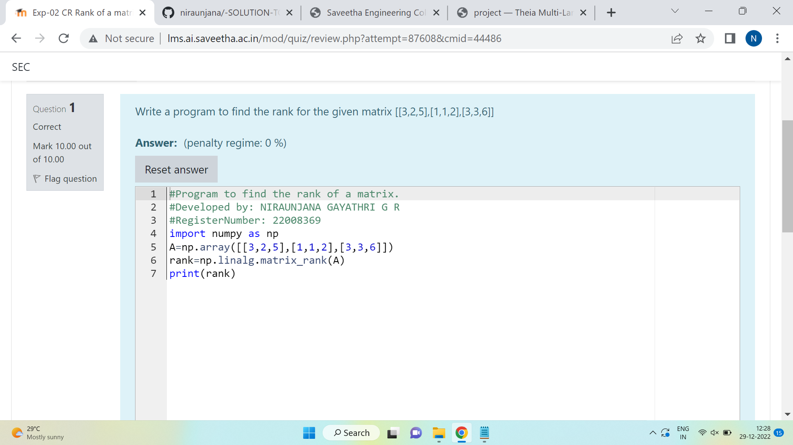

# RANK-OF-A-MATRIX
## Aim:
To write a python program to find the rank of a matrix
## Equipment’s required:
1. 	Hardware – PCs
2. 	Anaconda – Python 3.7 Installation / Moodle-Code Runner
## Algorithm:
### Step 1: 
import the numpy module to use the build-in functions for calculations
### Step 2: 
Prepare the lists from each linear equations and assign in np.array()
### Step 3:
 Using the np.linalg.matrix_rank(), we can find the rank of the given matrix.
### Step 4: 
End the Program
## Program:
```python
#Program to find the rank of a matrix.
#Developed by: NIRAUNJANA GAYATHRI G R
#RegisterNumber: 22008369
import numpy as np
A=np.array([[3,2,5],[1,1,2],[3,3,6]])
rank=np.linalg.matrix_rank(A)
print(rank)
```
## Output:

## Result:
Thus the rank for the given matrix is successfully solved by  using a python program.

